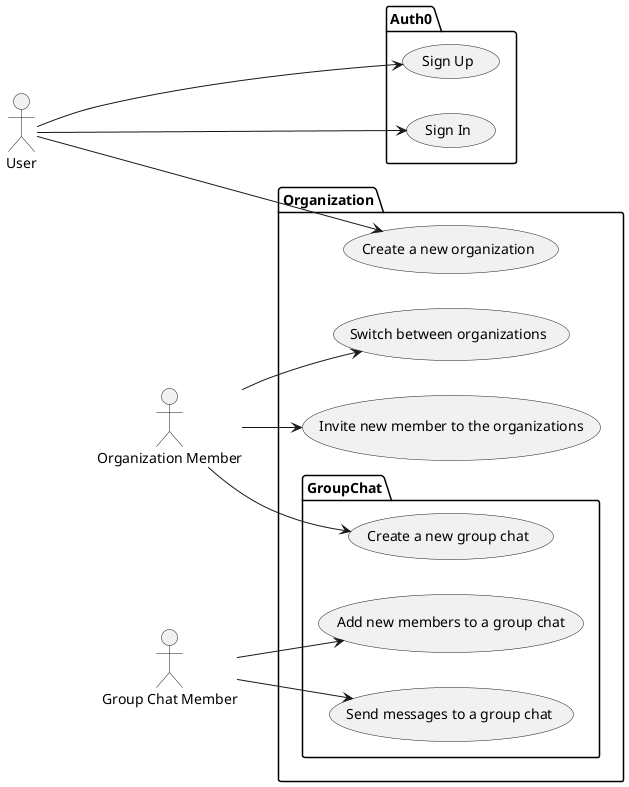
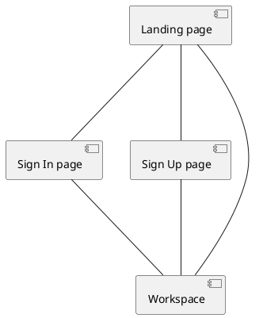
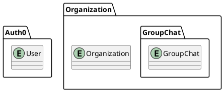

# Requirement

## What Is character?

<procedure>
<list>
<li>
A unified platform that allows you to seamlessly collaborate with your team—all without ever leaving your tab.
</li>
<li>
A comprehensive toolkit that brings together everything you need for work, including chat, task management, file storage, and more.</li>
</list>
</procedure>

## Use case

## Navigation Diagram

## UI/UX
[//]: # (TODO)

## Entity Relationship

